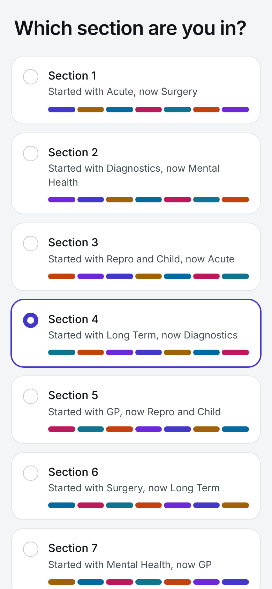
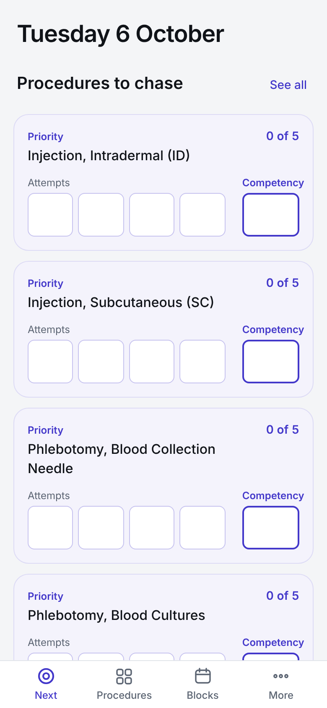
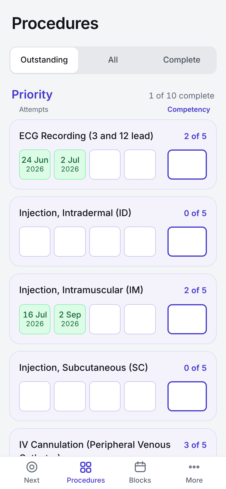
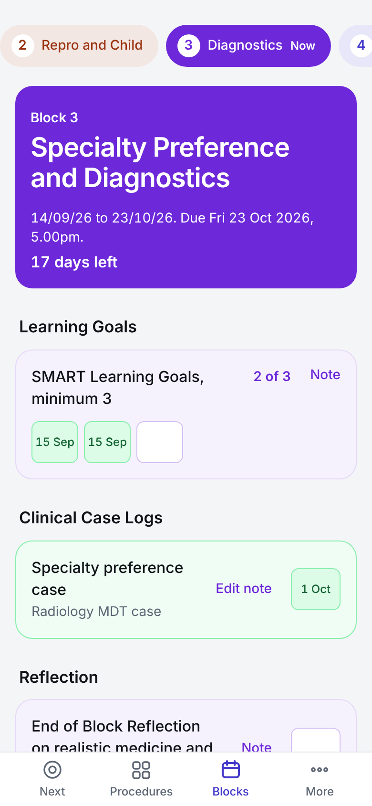

<div align="center">

# Year 4 Sign Offs

**A pocket tracker for Year 4 MBChB mandatory procedures and block requirements.**
Built for the University of Aberdeen Remote and Rural programme, 2026-27.

[**Open the app**](https://YOUR-USERNAME.github.io/year4-sign-offs/) · [Pocket booklet (PDF)](print/pocket-booklet-a5.pdf) · [A4 sheet (PDF)](print/procedure-sheet-a4.pdf)

<br>

&nbsp;
&nbsp;
&nbsp;


</div>

<br>

## What it does

| Tab | What it does |
|---|---|
| **Next** | Opens on today. Shows the five procedures most worth chasing and what is still outstanding in your current block, with the days left until the deadline. |
| **Procedures** | All 25 mandatory procedures. Priority procedures have four attempts and a competency assessment; Required procedures have two attempts. Filter by Outstanding, All or Complete. |
| **Blocks** | All seven blocks for your section, each with its own colour, dates and deadline. Learning goals, case logs, workplace assessments, attendance, reflections and core cases, with one box per item you need. |
| **More** | Your section, backup and restore, and how to add the app to your home screen. |

It works offline, needs no account, and keeps everything on your own phone.

<br>

## Getting started

1. Open the link on your phone.
2. Choose your section. The app shows what each section started with and what it is on now, so you can check you have the right one.
3. On an iPhone, open it in Safari, tap **Share**, then **Add to Home Screen**. On Android, use the browser menu and choose **Install app** or **Add to Home screen**.

You only choose your section once. To change it later, go to **More** and tap **Change section**. Anything you have already ticked stays with its specialty, so switching only moves the dates.

<br>

## Using it on the ward

- **Tap an empty box** to sign it off with today's date. The next empty attempt fills first; the competency box fills on its own.
- **Change the date** straight away from the bar that appears at the bottom, or tap a filled box at any time.
- **Undo** sits in the same bar for a few seconds after every change.
- **Add a note** to any block item. Keep notes free of patient identifiable information.
- **Prefer paper?** Print the [pocket booklet](print/pocket-booklet-a5.pdf) and copy the dates across later.

<br>

## Your data

Your sign offs are saved in your phone's browser and never leave it. Nobody else can see them, including whoever hosts the app.

That also means they are not backed up anywhere unless you do it yourself. Use **More → Back up** every week or two, and keep the file somewhere safe such as Files, iCloud Drive or email to yourself. **More → Restore** brings everything back on a new phone. The app reminds you on the Next tab when a backup is overdue.

On a laptop in Chrome or Edge, Back up can link to one file and keep it updated automatically after each change.

<br>

## Block dates

The seven blocks share the same dates across all sections. Each deadline is **5.00pm on the last Friday**.

| Block | Dates |
|:---:|---|
| 1 | 08/06/26 to 17/07/26 |
| 2 | 03/08/26 to 11/09/26 |
| 3 | 14/09/26 to 23/10/26 |
| 4 | 09/11/26 to 18/12/26 |
| 5 | 11/01/27 to 19/02/27 |
| 6 | 22/02/27 to 02/04/27 |
| 7 | 19/04/27 to 28/05/27 |

<details>
<summary><strong>Rotation by section</strong></summary>
<br>

| Section | Block 1 | Block 2 | Block 3 | Block 4 | Block 5 | Block 6 | Block 7 |
|:---:|---|---|---|---|---|---|---|
| 1 | Acute | Mental Health | Surgery | GP | Long Term | Repro and Child | Diagnostics |
| 2 | Diagnostics | Acute | Mental Health | Surgery | GP | Long Term | Repro and Child |
| 3 | Repro and Child | Diagnostics | Acute | Mental Health | Surgery | GP | Long Term |
| 4 | Long Term | Repro and Child | Diagnostics | Acute | Mental Health | Surgery | GP |
| 5 | GP | Long Term | Repro and Child | Diagnostics | Acute | Mental Health | Surgery |
| 6 | Surgery | GP | Long Term | Repro and Child | Diagnostics | Acute | Mental Health |
| 7 | Mental Health | Surgery | GP | Long Term | Repro and Child | Diagnostics | Acute |

*Acute* is Acute Medicine and Critical Care, *Long Term* is Long Term Conditions and Integrated Care, *Repro and Child* is Reproductive and Child Health, *Diagnostics* is Specialty Preference and Diagnostics, and *Surgery* is Surgery and Critical Care.

</details>

<br>

## How “Procedures to chase” is ranked

Each procedure with empty boxes gets a score:

```
score = (empty boxes ÷ total boxes) × weight  +  (days since last sign off ÷ 120) × 0.25
```

The weight is 1.35 for Priority and 1.0 for Required. Days since the last sign off are capped at 120, and a procedure with nothing logged counts as 120. Higher scores come first, with ties broken alphabetically. The list is worked out each time you open Next and holds still while you use it.

<br>

## Printing the booklet

The [pocket booklet](print/pocket-booklet-a5.pdf) is one A4 sheet that folds into an A5 booklet: a cover, Priority, Required and a notes page.

Print it on A4, **actual size**, **double-sided** with the printer's normal setting (**flip on long edge**), then fold along the small marks at the top and bottom of the centre line. If the inside comes out upside down, switch to flip on short edge.

<br>

## Please note

- This is an independent study aid made by a student. It is **not an official University of Aberdeen or NHS tool**.
- **SPARK and the ePortfolio remain the official record.** Always log your sign offs there.
- The block requirements were taken from the Section 4 ePortfolio for 2026-27 and are assumed to be the same for each specialty in every section. **Check them against your own ePortfolio**, and report anything that differs.
- Never store patient identifiable information in notes.

<br>

## For maintainers

The app is a static site with no build step and no dependencies, hosted on GitHub Pages.

```
index.html             the whole app: page, styles, script and content
manifest.webmanifest   home screen name, colours and icons
sw.js                  offline cache
icons/                 app icons
print/                 printable PDFs
screenshots/           images used in this README
```

**Publishing:** in the repository, open **Settings → Pages**, set the source to **Deploy from a branch**, choose **main** and **/ (root)**, and save. The site appears at `https://YOUR-USERNAME.github.io/year4-sign-offs/` within a few minutes.

**Updating:** upload the changed files with the same names and commit. When `index.html` changes, also raise the version number at the top of `sw.js` (for example `signoffs-v3` to `signoffs-v4`) so phones pick up the new copy. Users see the update the second time they open the app.

<br>

<div align="center">
<sub>Made by Joakim Edman, Year 4 MBChB, University of Aberdeen.</sub>
</div>
